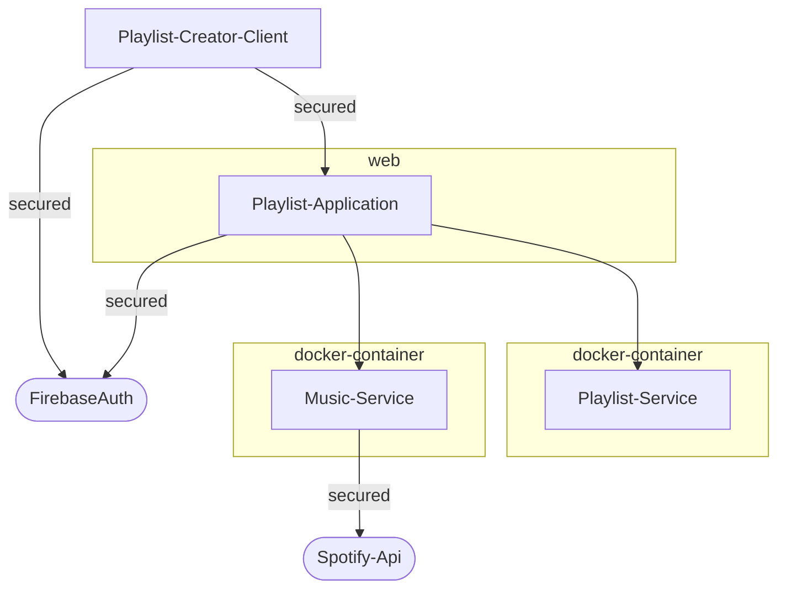
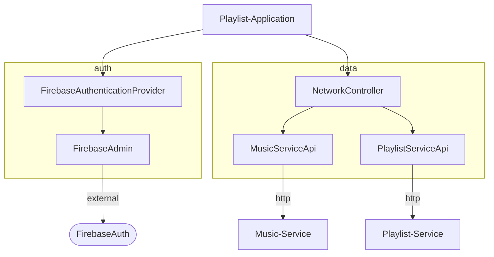
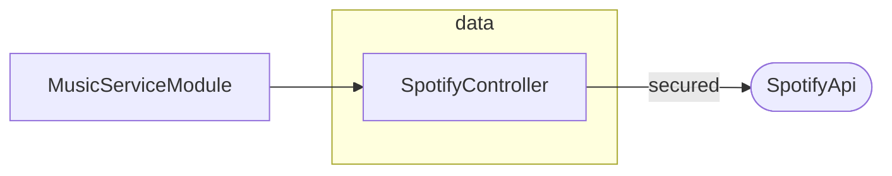
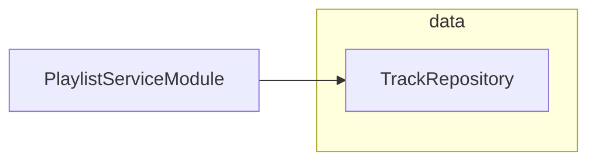

# System architecture

```mermaid
graph TD
    Playlist-Creator-Client
    id1([FirebaseAuth])
    id2([Spotify-Api])
    subgraph web
        Playlist-Application
    end
    subgraph docker-container 
        Music-Service
    end
    subgraph docker-container
        Playlist-Service
    end
    Playlist-Creator-Client-- secured -->id1([Firebase-Auth])
    Playlist-Creator-Client-- secured -->Playlist-Application 
    Playlist-Application-- secured -->id1([FirebaseAuth])
    Playlist-Application-->Music-Service
    Playlist-Application-->Playlist-Service
    Music-Service-- secured -->id2([Spotify-Api])
```

# Playlist-Application architecture

```mermaid
graph TD
    Playlist-Application
    subgraph auth
        FirebaseAuthenticationProvider
        FirebaseAdmin
    end
    subgraph data
        MusicServiceApi
        PlaylistServiceApi
        NetworkController
    end
    Playlist-Application-->FirebaseAuthenticationProvider
    FirebaseAuthenticationProvider-->FirebaseAdmin
    Playlist-Application-->NetworkController
    NetworkController-->MusicServiceApi
    NetworkController-->PlaylistServiceApi
    MusicServiceApi-- http -->Music-Service
    PlaylistServiceApi-- http -->Playlist-Service
    FirebaseAdmin-- external -->id([FirebaseAuth])
```

# Music-Service architecture

```mermaid
graph LR
    MusicServiceModule
    subgraph data
     SpotifyController
    end
    id1([SpotifyApi])
    MusicServiceModule-->SpotifyController
    SpotifyController-- secured -->id1([SpotifyApi])
```

# Playlist-Service architecture

```mermaid
graph LR
    PlaylistServiceModule
    subgraph data
        TrackRepository
    end
    PlaylistServiceModule-->TrackRepository
```